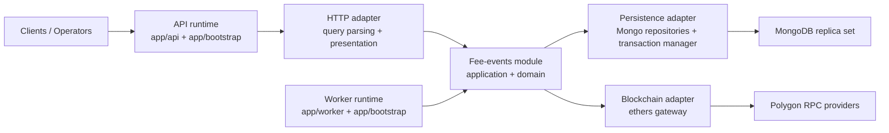
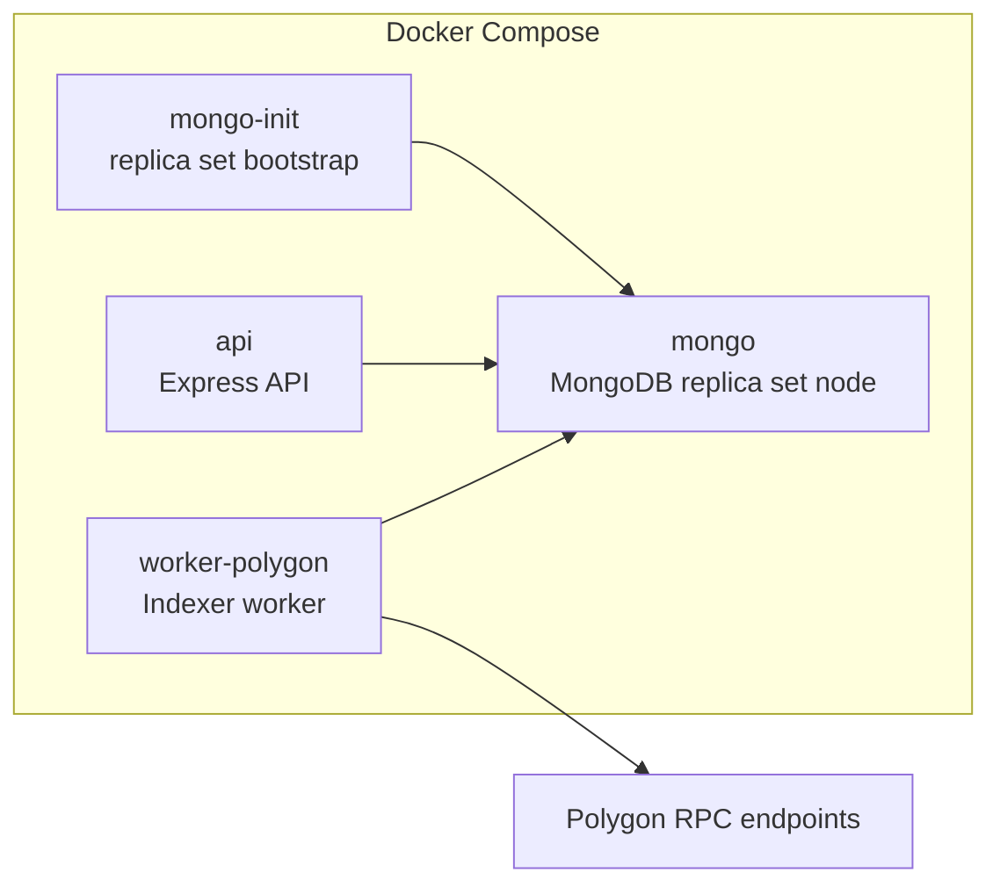

# Architecture

## Overview

This service indexes `FeesCollected` events from LI.FI's `FeeCollector` contract, stores normalized records in MongoDB, and exposes a read-only HTTP API for querying them by `integrator`.

The current implementation is a modular monolith with clean-architecture-style boundaries:

- `domain` keeps domain-level invariants and normalization logic
- `application` owns ports, worker orchestration, pagination, and scan planning
- `infrastructure` implements blockchain, persistence, and HTTP adapters
- `bootstrap` wires concrete adapters into runnable API and worker targets

Essential runtime facts:

- Node.js 24
- TypeScript
- Express 5
- `ethers` v5
- MongoDB + Typegoose

`ethers` is intentionally pinned to v5 because the current blockchain adapter is written against v5 APIs and the project scope explicitly targets that version.

MongoDB must run as a replica set, including locally, because the worker persists `fee_events` and advances `sync_state` in the same transaction.

## Conceptual Topology

At a conceptual level, the application has five zones:

- clients and operators outside the service boundary
- runtime entrypoints that start API and worker processes
- the fee-events module, which contains domain and application logic
- infrastructure adapters that talk to HTTP, MongoDB, and blockchain RPC
- external systems such as MongoDB and Polygon RPC providers



Read path:

- the API runtime accepts HTTP requests
- the HTTP adapter validates input and presents output
- the fee-events application query port is fulfilled by the Mongo repository

Write path:

- the worker runtime drives indexing cycles
- application services plan scan windows, manage leases, and coordinate batching
- infrastructure adapters fetch blockchain logs and persist transactional updates

This topology matters more than the folder structure: the API and worker are thin runtime shells, while the fee-events module owns the business flow and the infrastructure layer stays replaceable behind ports.

## Runtime Topology

The codebase has three runtime modes:

- `api`: starts only the HTTP API
- `worker`: starts only the indexing worker
- `all`: starts both in one process, intended for local/dev use only

The default local deployment in `docker-compose.yml` runs separate services:

- `mongo`
- `mongo-init`
- `api`
- `worker-polygon`



`worker-polygon` is the only worker defined in Docker Compose today. The configuration layer can describe more chains, but the shipped deployment template is still single-chain.

## Source Layout

Current source tree:

```text
src/
  app/
    api/
    bootstrap/
      http/
    worker/
  modules/
    fee-events/
      application/
        errors/
        ports/
        services/
      bootstrap/
      domain/
      infrastructure/
        abi/
        blockchain/
        config/
        dev/
        http/
        persistence/
          models/
          repositories/
  shared/
    config/
    logger/
    readiness/
```

### Layering

- `src/modules/fee-events/domain`
  Holds domain-focused logic that does not depend on Express, Mongo, or ethers. Right now this is lightweight and mostly centered on address normalization and invariants.
- `src/modules/fee-events/application`
  Holds port interfaces plus worker-specific logic such as scan-window planning, cursor encoding/decoding, partition-key building, adaptive batch control, and the indexer service.
- `src/modules/fee-events/infrastructure`
  Implements the application ports:
  - blockchain access through `ethers`
  - MongoDB persistence through Mongoose/Typegoose
  - HTTP request parsing and response presentation
  - environment-driven worker config
  - a fixture gateway for development/testing
- `src/modules/fee-events/bootstrap`
  Exposes module-level wiring helpers for HTTP routers and worker targets.
- `src/app`
  Provides generic runtime assembly:
  - process entrypoints
  - shared startup/shutdown flow
  - Express app assembly
  - worker loop execution
- `src/shared`
  Provides cross-cutting concerns shared across app and module boundaries:
  - env parsing
  - logging
  - readiness tracking

### Dependency Direction

- `domain` does not know about frameworks or process environment
- `application` depends on `domain` and port contracts
- `infrastructure` depends on `application` to implement ports
- `bootstrap` and `app` instantiate concrete infrastructure and start the selected runtime
- `shared` contains cross-cutting helpers used by multiple layers

## Shared Startup

Both API and worker runtimes go through the same shared initialization in `src/app/bootstrap/runtime.ts`:

1. parse and validate environment
2. create a `pino` logger
3. connect to MongoDB
4. wait until Mongo reports replica-set transaction readiness
5. apply indexes via `syncIndexes()`
6. register readiness checks

This means the API and worker both fail fast if Mongo is unavailable or not transaction-ready.

## API Runtime

The API entrypoint is `src/app/api/main.ts`. It starts `startApiRuntime()`, which initializes shared runtime state and then creates the Express server.

### HTTP assembly

`createHttpApp()` builds the app with:

- `helmet`
- `express.json()`
- request trace id middleware
- `pino-http`
- health routes
- module routers
- centralized API error handling

### Endpoints

Implemented endpoints:

- `GET /v1/fees`
- `GET /health/live`
- `GET /health/ready`

`GET /v1/fees` is the only business endpoint today. It:

1. validates query params with Zod
2. normalizes `integrator` via domain address normalization
3. validates an incoming cursor by decoding it eagerly
4. queries Mongo through `MongoFeeEventRepository`
5. returns a presenter-shaped response with `data[]` and `page.nextCursor`

### Error handling

The API returns a stable problem-details-style envelope:

```json
{
  "type": "validation_error",
  "title": "Invalid request",
  "status": 400,
  "detail": "integrator: Expected a valid EVM address",
  "traceId": "..."
}
```

Current handled categories:

- `invalid_cursor`
- `validation_error`
- `internal_error`

### Readiness

`GET /health/live` returns `200` when the process is up.

`GET /health/ready` returns:

- `200` when config validation, Mongo connectivity, transaction readiness, and index setup are complete
- `503` with a problem response otherwise

## Worker Runtime

The worker entrypoint is `src/app/worker/main.ts`. It starts `startWorkerRuntime()`, resolves a concrete worker target, and runs `runWorkerLoop()`.

### Target resolution

Worker target selection is driven by:

- `WORKER_MODULE`
- `WORKER_EVENT`
- `WORKER_CHAIN_KEY`

The only registered target today is:

- `fee-events:fees-collected`

That target is wired in `src/modules/fee-events/bootstrap/create-fee-events-worker-targets.ts` and currently creates:

- `IndexerService`
- `EthersFeesCollectedGateway` or fixture gateway
- `MongoFeeEventRepository`
- `MongoSyncStateRepository`
- `MongoTransactionManager`

### Indexing flow

`IndexerService` owns one logical partition:

- `(chainId, contractAddress, eventName)`

A single `runOnce()` cycle does the following:

1. acquire a lease in `sync_state`
2. load the current sync state
3. resolve `safeHead`
4. plan a bounded scan window
5. fetch logs in adaptive batches
6. parse and normalize events
7. commit events and cursor progress in one Mongo transaction

Detailed behavior:

- Lease ownership is coordinated through `sync_state.leaseOwner` and `sync_state.leaseUntil`
- `safeHead` is resolved from the `finalized` block when the RPC supports it; otherwise the gateway falls back to `latest - confirmationsFallback`
- the first cycle after startup intentionally replays the configured lookback window
- adaptive batching shrinks batch size on retryable RPC failures and grows it again after successful batches
- continuous mode sleeps for `WORKER_POLL_INTERVAL_MS` between cycles
- `--once` mode exits after a single loop, which is useful for smoke checks and debugging

### Transaction boundary

Each committed batch executes:

1. `feeEventRepository.replaceRange(...)`
2. `syncStateRepository.updateProgress(...)`

inside `MongoTransactionManager.withTransaction(...)`.

This guarantees that event persistence and cursor advancement move together.

## Blockchain Adapter

The blockchain adapter lives in `src/modules/fee-events/infrastructure/blockchain`.

Current behavior:

- builds one `JsonRpcProvider` per configured RPC URL
- wraps multiple URLs in an `ethers.providers.FallbackProvider`
- uses a checked-in minimal `FeeCollector` ABI
- queries only the `FeesCollected` event
- fetches block timestamps for returned logs
- maps raw provider data into normalized application events

There is no separate RPC retry/backoff layer beyond provider fallback and adaptive batch shrinking.

## Persistence Model

Two MongoDB collections are part of the current architecture.

### `fee_events`

Purpose:

- store normalized `FeesCollected` records
- serve the API read path

Stored fields include:

- chain and contract identity
- block and transaction identity
- token, integrator, and fee amounts
- `removed`
- `orphaned`
- raw topics/data when available
- `syncedAt`

Current indexes:

- unique: `(chainId, blockHash, logIndex)`
- read path: `(chainId, integrator, orphaned, blockNumber desc, logIndex desc, _id desc)`
- cross-chain read path: `(integrator, orphaned, blockNumber desc, logIndex desc, chainId desc, _id desc)`
- range maintenance: `(chainId, contractAddress, eventName, orphaned, blockNumber)`

`replaceRange()` upserts all events in the scanned window and marks previously stored events in that same range as `orphaned` when they are no longer present in the incoming canonical set.

### `sync_state`

Purpose:

- store progress per worker partition
- coordinate lease ownership

Important fields:

- `key`
- `chainId`
- `contractAddress`
- `eventName`
- `lastFinalizedScannedBlock`
- `reorgLookback`
- `status`
- `leaseOwner`
- `leaseUntil`
- `lastHeartbeatAt`
- `lastError`
- `updatedAt`

Current indexes:

- unique: `(key)`
- lease lookup: `(leaseUntil)`

There is no `processed_blocks` collection in the current implementation.

## Query Semantics

The read path is implemented by `MongoFeeEventRepository.getFeesByIntegrator()`.

Current behavior:

- `integrator` is required
- `chainId`, `fromBlock`, `toBlock`, `limit`, and `cursor` are optional
- default `limit` is `100`
- maximum `limit` is `500`
- results are ordered by `blockNumber desc`, `logIndex desc`, `chainId desc`, `_id desc`
- the cursor encodes the same ordering fields
- API reads exclude `orphaned: true`

This supports both single-chain and cross-chain reads for one integrator, depending on whether `chainId` is provided.

## Configuration

Configuration is fully environment-driven and validated at startup.

Main groups:

- shared runtime config:
  - `PORT`
  - `LOG_LEVEL`
  - `MONGODB_URI`
  - worker timing and startup timeout settings
- chain catalog:
  - `CHAIN_KEYS`
  - `CHAIN_<CHAIN>_ID`
  - `CHAIN_<CHAIN>_NAME`
  - `CHAIN_<CHAIN>_RPC_URLS`
- worker selection:
  - `WORKER_CHAIN_KEY`
  - `WORKER_MODULE`
  - `WORKER_EVENT`
- fee-events worker tuning:
  - `CHAIN_<CHAIN>_FEE_COLLECTOR_ADDRESS`
  - `CHAIN_<CHAIN>_START_BLOCK`
  - `WORKER_REORG_LOOKBACK`
  - batch-size settings
  - `FEE_EVENTS_GATEWAY_MODE`

`.env.example` currently ships with Polygon as the default configured chain and with `fee-events:fees-collected` as the selected worker target.

## Current Scope

This document describes only what is implemented today.

Not part of the current architecture:

- `/metrics`
- `processed_blocks`
- migration-driven index rollout
- multi-chain Docker deployment templates
