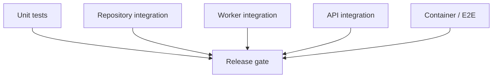
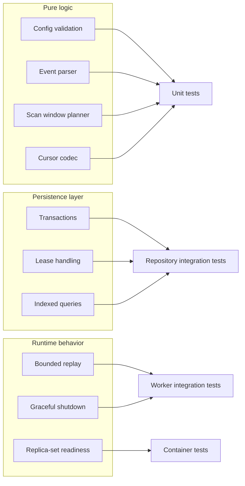

# Test Cases

## 1. Test Strategy

The release gate should be built around four layers:

- unit tests for pure logic
- repository and transaction integration tests
- worker integration tests
- API integration tests

All integration tests that touch Mongo transactions should run against a replica set, including local in-memory test runs.

## 2. Unit Test Cases

| ID       | Area                  | Scenario                                   | Expected result                                            |
| -------- | --------------------- | ------------------------------------------ | ---------------------------------------------------------- |
| `UT-001` | Env config            | required env var is missing                | startup config parsing fails with a clear validation error |
| `UT-002` | Env config            | chain config contains invalid EVM address  | config parsing fails                                       |
| `UT-003` | Address normalization | checksum or mixed-case address is provided | normalized lowercase canonical storage value is returned   |
| `UT-004` | Event parser          | valid `FeesCollected` log is parsed        | domain DTO contains token, integrator, fees, tx metadata   |
| `UT-005` | Event parser          | token is zero address                      | parser accepts it and does not treat it as invalid         |
| `UT-006` | Event parser          | fee amounts exceed JS safe integer range   | amounts are returned as decimal strings                    |
| `UT-007` | Safe head resolver    | provider supports `finalized`              | finalized block number is used                             |
| `UT-008` | Safe head resolver    | provider does not support `finalized`      | fallback `latest - confirmations` is used                  |
| `UT-009` | Scan window planner   | cursor is before start block               | `fromBlock` is clamped to `startBlock`                     |
| `UT-010` | Scan window planner   | lookback is enabled                        | `fromBlock` rewinds by bounded lookback                    |
| `UT-011` | Scan window planner   | `fromBlock > safeHead`                     | planner returns no-op window                               |
| `UT-012` | Batch controller      | timeout occurs                             | batch size is reduced                                      |
| `UT-013` | Batch controller      | repeated successes occur                   | batch size increases up to max                             |
| `UT-014` | Cursor codec          | page cursor is encoded and decoded         | stable round-trip without information loss                 |
| `UT-015` | API validation        | invalid `integrator` query param           | validation error is produced                               |
| `UT-016` | API validation        | `limit` exceeds max                        | validation error is produced                               |
| `UT-017` | Lease key builder     | same partition input twice                 | identical key is produced                                  |
| `UT-018` | ABI adapter           | wrong event signature is encountered       | parser rejects non-target logs                             |

## 3. Repository Integration Test Cases

These tests should use Mongo transactions against a replica set.

| ID          | Area                 | Scenario                                                                     | Expected result                                                     |
| ----------- | -------------------- | ---------------------------------------------------------------------------- | ------------------------------------------------------------------- |
| `IT-DB-001` | `fee_events` index   | same canonical event is written twice                                        | only one document exists                                            |
| `IT-DB-002` | upsert behavior      | same event is replayed during lookback                                       | write is idempotent                                                 |
| `IT-DB-003` | transaction manager  | events and cursor are written together                                       | both commit atomically                                              |
| `IT-DB-004` | transaction rollback | event write succeeds but cursor update throws                                | neither partial events nor cursor advancement remain after rollback |
| `IT-DB-005` | lease acquisition    | two workers try to acquire the same lease                                    | only one succeeds                                                   |
| `IT-DB-006` | lease takeover       | first worker lease expires                                                   | second worker acquires ownership                                    |
| `IT-DB-007` | query repository     | events are filtered by `integrator`                                          | only matching events are returned                                   |
| `IT-DB-008` | query repository     | results span multiple pages                                                  | cursor pagination is stable and deterministic                       |
| `IT-DB-009` | sorting              | multiple events in same block                                                | order is `(blockNumber desc, logIndex desc)`                        |
| `IT-DB-010` | amount persistence   | large fee values are stored                                                  | values remain exact strings                                         |
| `IT-DB-011` | cross-chain query    | same integrator has events on multiple chains and `chainId` filter is absent | repository returns the merged, deterministically ordered result set |

## 4. Worker Integration Test Cases

These tests should use:

- Mongo replica set
- mocked or fake blockchain gateway
- real application services

| ID         | Area                          | Scenario                                                                      | Expected result                                                    |
| ---------- | ----------------------------- | ----------------------------------------------------------------------------- | ------------------------------------------------------------------ |
| `IT-W-001` | initial backfill              | empty database, safe head above start block                                   | worker ingests all windows from `startBlock`                       |
| `IT-W-002` | steady state no-op            | cursor already at safe head                                                   | worker performs no writes                                          |
| `IT-W-003` | restart recovery              | worker restarts after previous success                                        | next cycle resumes from bounded lookback window                    |
| `IT-W-004` | persistence failure           | DB write fails mid-cycle                                                      | cursor does not advance                                            |
| `IT-W-005` | RPC timeout                   | provider times out on large range                                             | worker retries with smaller batch size                             |
| `IT-W-006` | duplicate replay              | lookback returns already-seen events                                          | duplicates are not created                                         |
| `IT-W-007` | finalized head path           | provider supports finalized                                                   | worker uses finalized safe head                                    |
| `IT-W-008` | fallback head path            | provider lacks finalized                                                      | worker uses fallback confirmations strategy                        |
| `IT-W-009` | graceful shutdown             | shutdown signal arrives during processing                                     | current batch finishes or rolls back safely, process exits cleanly |
| `IT-W-010` | lease heartbeat               | long batch exceeds initial lease interval                                     | lease is renewed before expiry                                     |
| `IT-W-011` | lease contention              | second worker starts while first is healthy                                   | second worker remains idle for that partition                      |
| `IT-W-012` | release-path bounded replay   | the same finalized lookback window is replayed after restart                  | worker converges without duplicates or cursor regression           |
| `IT-W-013` | hardening-path reorg tracking | same block number reappears with different hash and block tracking is enabled | canonical/orphan handling path is triggered                        |

## 5. API Integration Test Cases

These tests should use Supertest against the real Express app with a test database.

| ID           | Area              | Scenario                                                                  | Expected result                                                           |
| ------------ | ----------------- | ------------------------------------------------------------------------- | ------------------------------------------------------------------------- |
| `IT-API-001` | validation        | `integrator` is missing                                                   | `400` response                                                            |
| `IT-API-002` | validation        | `integrator` is invalid                                                   | `400` response                                                            |
| `IT-API-003` | happy path        | valid `integrator` with matching events                                   | `200` with matching records                                               |
| `IT-API-004` | filtering         | `chainId` is provided                                                     | only selected chain data is returned                                      |
| `IT-API-005` | filtering         | `fromBlock` and `toBlock` are provided                                    | results stay inside range                                                 |
| `IT-API-006` | pagination        | more than one page exists                                                 | response returns `nextCursor`                                             |
| `IT-API-007` | serialization     | fees are large integers                                                   | API returns them as strings                                               |
| `IT-API-008` | empty result      | no events exist for integrator                                            | `200` with empty `data` array                                             |
| `IT-API-009` | sorting           | events share nearby block numbers                                         | response order is deterministic                                           |
| `IT-API-010` | readiness         | DB is connected and config valid                                          | `/health/ready` returns `200`                                             |
| `IT-API-011` | cursor validation | `cursor` is malformed or tampered                                         | `400` response using the standard error envelope                          |
| `IT-API-012` | error contract    | validation error occurs                                                   | response contains `type`, `title`, `status`, `detail`, and `traceId`      |
| `IT-API-013` | error contract    | unexpected server error occurs                                            | response contains the standard error envelope and does not leak internals |
| `IT-API-014` | cross-chain query | `chainId` is omitted for an integrator that has events on multiple chains | API returns the merged, deterministically ordered result set              |

## 6. End-to-End / Container Test Cases

These can be automated later with Docker Compose or Testcontainers.

| ID        | Area                      | Scenario                                                  | Expected result                                                                   |
| --------- | ------------------------- | --------------------------------------------------------- | --------------------------------------------------------------------------------- |
| `E2E-001` | Docker bootstrap          | compose stack starts                                      | API, worker, and Mongo become healthy                                             |
| `E2E-002` | transaction support       | Mongo starts without replica-set support                  | application fails fast at startup                                                 |
| `E2E-003` | indexing flow             | worker indexes seeded blockchain events                   | API returns indexed data                                                          |
| `E2E-004` | restart behavior          | worker container is restarted                             | indexing resumes without data loss                                                |
| `E2E-005` | replica-set election race | Mongo is reachable but not yet writable/transaction-ready | API and worker stay unready and retry until the replica set becomes primary-ready |
| `E2E-006` | readiness contract        | indexes are not yet created during startup                | `/health/ready` stays non-ready until initialization completes                    |

## 7. Manual Smoke Checks

These checks are useful before review:

1. Start Docker Compose and confirm Mongo replica set is initialized.
2. Run worker in `--once` mode against a narrow block range.
3. Confirm `fee_events` and `sync_state` are both written in one successful cycle.
4. Call `GET /v1/fees` for a known integrator.
5. Restart the worker and confirm only bounded lookback blocks are replayed.

## 8. Release Gate

Minimum automated gate:

- all unit tests pass
- repository transaction tests pass
- worker recovery tests pass
- API integration tests pass
- startup fails when transaction support is unavailable
- readiness stays false until Mongo is transaction-ready
